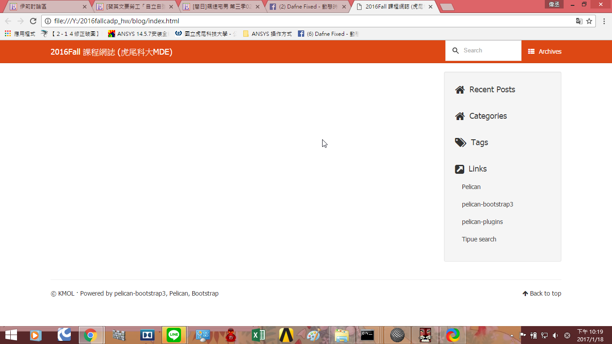
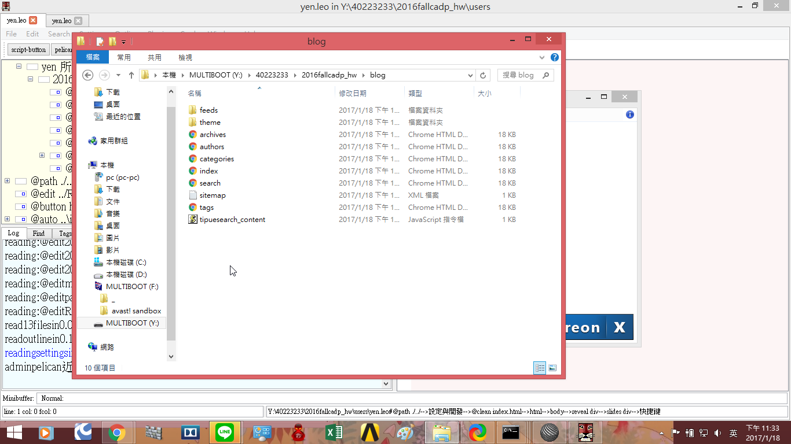

Title: 2016Fall 電腦輔助設計實習課程總結
Date: 2017-01-18 23:36
Category: Misc
Tags: 期末
Author: 40223130

在課程剛開始的時候因為對之前的上課內容還有印象，所以在課堂上很快就能推送成功，但是在期中遇到一些問題沒有在課堂上解決後漸漸地跟不上。上課的時候都有試著畫過Onshape跟SolveSpace並在期末補上影片，在最後一個禮拜突然發現近端執行的網誌是空的

後來發現每次近端執行後blog裡面不會跑出每一篇網誌的對應頁面

雖然網誌都打好了可是深怕直接上傳會毀了之前的進度所以不敢上傳，直到後來把整個程式全部翻新才有所改善。雖然到最後還是不知道怎麼回事，不過發現的時候已經超過時限了，但在此還是盡量補上。
<!-- PELICAN_END_SUMMARY -->